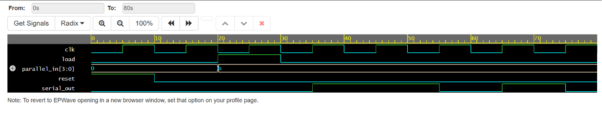

## High-Throughput 4-Bit Data Serialization Core (VLSI)
A 4-bit Parallel-In Serial-Out (PISO) data serializer designed in Verilog HDL. Converts 4-bit parallel data streams into a single bit-serial transmission line synchronized to a system clock. This architecture is a fundamental hardware block used in high-speed communication interfaces (such as SPI/UART protocol pipelines).

### Technical Overview
- **Language:** Verilog (RTL Design)
- **Simulation Platform:** EDA Playground / Icarus Verilog
- **Key Concepts:** Shift registers, synchronous reset logic, right-shift bit operations.

### Verification Waveform Result
The timing diagram below demonstrates successful hardware verification using Icarus Verilog via EDA Playground::

### Waveform Analysis
Reset State (0ns - 10ns): reset is HIGH, forcing internal registers and outputs to 0.

Parallel Load Phase (10ns - 30ns): load goes HIGH, latching the 4-bit parallel vector (b hex / 1011 binary) into the shift register.

Serial Output Phase (30ns onwards): load drops LOW. On each clock cycle edge, data bits are sequentially shifted out onto serial_out
